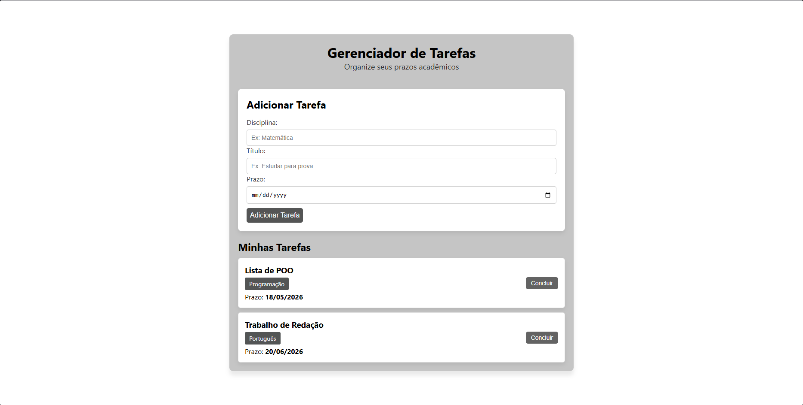

# Parte Visual do Gerenciador de Tarefas Acadêmicas

Um sistema web moderno e minimalista para organização de tarefas, trabalhos e prazos de disciplinas escolares ou acadêmicas.

Este repositório contém a interface visual (**Front-End**) do projeto. O desenvolvimento foi focado na criação de uma estrutura limpa em HTML e na aplicação avançada de **Flexbox** para o alinhamento e responsividade dos elementos.

> **Nota do Projeto:** O desenvolvimento do Back-End deste gerenciador já foi concluído e está disponível em outro repositório no meu GitHub. Atualmente, as duas partes operam de forma independente, pois a integração via API (conexão entre Front e Back) será realizada nos próximos passos dos meus estudos!

---

## Tecnologias Utilizadas

* **HTML5:** Estruturação semântica da página.
* **CSS3 (Moderno):** Estilização visual, uso de variáveis de cores, efeitos de feedback visual (`:hover`) e aninhamento (*nesting*) de seletores.
* **Flexbox Layout:** Utilizado estrategicamente para centralização da aplicação, organização dos campos do formulário e distribuição do espaço dos blocos de tarefas (`space-between`).

---

## Funcionalidades do Layout

* **Painel de Cadastro:** Área exclusiva e destacada para inserção do título da tarefa, disciplina e data de entrega.
* **Cards de Tarefas Dinâmicos:** Exibição lado a lado das informações da tarefa e do botão de conclusão, garantindo equilíbrio visual.
* **Feedback Interativo:** Todos os botões e tags interativas mudam de cor ao passar o mouse (`:hover`), indicando ações clicáveis.
* **Design Responsivo:** Adaptável para diferentes tamanhos de tela.

---

## Como Executar o Front-End Localmente

1. Faça o clone deste repositório ou baixe os arquivos.
2. Certifique-se de que o arquivo `index.html` e o arquivo `style.css` estão na mesma pasta (ou com o caminho devidamente referenciado).
3. Abra o arquivo `index.html` diretamente em qualquer navegador web (Chrome, Edge, Firefox).

---

## Aprendizados Adquiridos neste Módulo

* Resete de estilos padrões de navegadores com `box-sizing: border-box`.
* Controle de eixos do Flexbox (`flex-direction: row` e `column`).
* Alinhamento bidimensional com `justify-content` e `align-items`.
* Uso de propriedades de isolamento como `display: inline-block` em elementos de texto.
